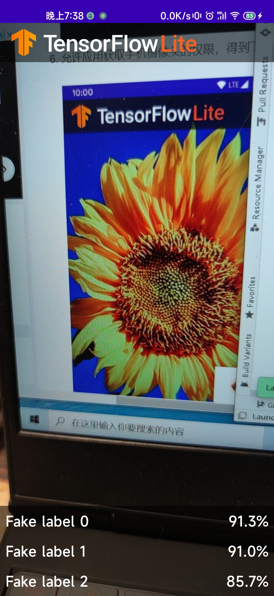

## 一、在GitHub拉取项目并测试：

1.创建工作目录，打开windows的cmd窗口，运行以下命令：

`git clone https://github.com/hoitab/TFLClassify.git`

如图：

2.使用Android Studio打开刚刚下载的项目：

3.选择TFLClassify/build.gradle生成整个项目。

此前，需要修改其中的sdk版本为当前Android Studio存在的sdk版本，且需要在“30+”

接着点击sync now，导入相应的gradle wrapper:

4.使用USB连接手机，手机在开发者选项中打开USB调试

5.在Android Studio中选择自己的物理机，运行start模块：

手机截图如下：

## 二、向应用中添加TensorFlow Lite

1.右键“start”模块，然后New>Other>TensorFlow Lite Model

2.选择finish模块中ml文件下的FlowerModel.tflite

3.TenserFlow Lite模型导入成功：

## 三、添加代码，重新运行App

1.在“start”模块MainActivity.kt文件的TODO 1，添加如下代码：

`private class ImageAnalyzer(ctx: Context, private val listener: RecognitionListener) :`
        `ImageAnalysis.Analyzer {`

  `...`
  `// TODO 1: Add class variable TensorFlow Lite Model`
  `private val flowerModel = FlowerModel.newInstance(ctx)`

  `...`
`}`

2.在CameraX的analyze方法内部，将摄像头的输入`ImageProxy`转化为`Bitmap`对象，并进一步转化为`TensorImage` 对象，TODO2：

`override fun analyze(imageProxy: ImageProxy) {`
  `...`
  `// TODO 2: Convert Image to Bitmap then to TensorImage`
  `val tfImage = TensorImage.fromBitmap(toBitmap(imageProxy))`
  `...`
`}`

3.对图像进行处理并生成结果，TODO3：

`override fun analyze(imageProxy: ImageProxy) {`
  `...`
  `// TODO 3: Process the image using the trained model, sort and pick out the top results`
  `val outputs = flowerModel.process(tfImage)`
      `.probabilityAsCategoryList.apply {`
          `sortByDescending { it.score } // Sort with highest confidence first`
      `}.take(MAX_RESULT_DISPLAY) // take the top results`

  `...`
`}`

4.将识别的结果加入数据对象`Recognition` 中，包含`label`和`score`两个元素，TODO4：

`override fun analyze(imageProxy: ImageProxy) {`
  `...`
  `// TODO 4: Converting the top probability items into a list of recognitions`
  `for (output in outputs) {`
      `items.add(Recognition(output.label, output.score))`
  `}`
  `...`
`}`

5.将以下代码注释掉（原先用于虚拟显示识别结果）：// START - `Placeholder code at the start of the codelab. Comment this block of code out.`
`for (i in 0..MAX_RESULT_DISPLAY-1){`
    `items.add(Recognition("Fake label $i", Random.nextFloat()))`
`}`
`// END - Placeholder code at the start of the codelab. Comment this block of code out.`

6.手机上先卸载之前安装的TFL Classify APP， 重新运行start模块：

APP效果如图：

